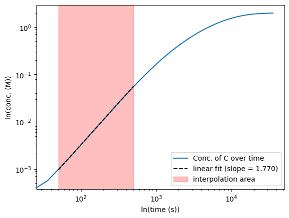

Import Simulator from library:


```python
from kinetic_simulator import Simulator
```

Set up a simulation and run it:


```python
# initialize simulator and its temperature (in °C)
sim = Simulator(T_C=50)

# add species, concentrations (M) and relative energies9 (kcal/mol).
# Default values for energy and concentration are 0.
sim.add_species("A", conc=1)
sim.add_species("B", energy=-2)
sim.add_species("B(adsorbed)", energy=-2.5)
sim.add_species("C", energy=-30)

# add reactions by specifying their activation
# energy (in kcal/mol)
sim.add_reaction(["A"], ["B", "B"], ts_energy=23.0)

# or their rate constant (in M^n * s^-1)
sim.add_reaction(["B"], ["C"], rate=5e-4)

# it is also possible to enforce a K_eq (overriding
# the energy value assigned to the involved species).
# The rate of the reaction will be assumed as fast,
# to ensure equilibration at any point in time.
sim.add_reaction(["B"], ["B(adsorbed)"], enforced_K_eq=2.18)

# specify the timeframe of the simulation and run it
sim.run(time=10, t_units="h")
```

    
    --> "A -> B + B" will be evolved step-by-step (Rel. rate = 3.66).
    --> "B -> C" will be evolved step-by-step (Rel. rate = 1.00).
    --> "B -> B(adsorbed)" will be enforced at the provided equilibrium constant (K_eq = 2.18).
    
    -> Running simulation for 10 h with the backwards_euler method (3.6 s increments, 10000 iterations)
    Iterations  |##################################################| 100.0% 
    
    --> Simulation complete (4.2 s)


Show results:


```python
sim.show()
```

    
    Final Concentrations:
    A           : 0.00 M (0.0 % of initial conc., 100.00 % consumed)
    B           : 0.00 M (0.12 % total molar fraction)
    B(adsorbed) : 0.01 M (0.26 % total molar fraction)
    C           : 1.99 M (99.62 % total molar fraction)
    


    

    


Only visualize the evolution of some species:


```python
sim.show(
    species=('B', 'B(adsorbed)')
)
```

    
    Final Concentrations:
    B           : 0.00 M (0.12 % total molar fraction)
    B(adsorbed) : 0.01 M (0.26 % total molar fraction)
    


    

    


Simulator data is available for further manipulation:


```python
import matplotlib.pyplot as plt
import numpy as np

# plot [C] vs. time in a loglog plot
C_concs = sim.conc_data[:,sim.species_id_dict["C"]]
plt.loglog(sim.time_data, C_concs, label='Conc. of C over time')
plt.xlabel('ln(time (s))')
plt.ylabel('ln(conc. (M))')

# define and plot an interpolation time range
start, end = 5E1, 5E2 # 1E3
plt.axvspan(start, end, color='red', alpha=0.25, label="interpolation area")

# get boundary indices of arrays 
start_idx = next(index+1 for index, value in enumerate(sim.time_data[1:]) if value > start)
end_idx = len(sim.time_data) - 2 - next(index for index, value in enumerate(reversed(sim.time_data[:-1])) if value < end)

# fit line through logarithms, in the defined range
log_time_interp = np.log(sim.time_data[start_idx:end_idx])
log_conc_interp = np.log(C_concs[start_idx:end_idx])
X = np.vstack([log_time_interp, np.ones(log_time_interp.shape[0])]).T
m, c = np.linalg.lstsq(X, log_conc_interp, rcond=None)[0]

# draw an interpolation line
x_fit = (start, end)
y_fit = (start**m * np.exp(c), end**m * np.exp(c))
plt.plot(x_fit, y_fit, label=f"linear fit (slope = {m:.3f})", color="black", linestyle="dashed", markersize=4)
_ = plt.legend()
```


    

    


It is also possible to track how much material was obtained through different pathways:


```python
sim = Simulator()

sim.add_species("A", conc=1)
sim.add_species("B", energy=0.8)
sim.add_species("C", energy=-30)

sim.add_reaction(["A"], ["B"], ts_energy=20.0)
sim.add_reaction(["A", "B"], ["C", "C"], ts_energy=22.1, throughput_target="C")
sim.add_reaction(["A", "A"], ["C", "C"], ts_energy=21.5, throughput_target="C")

sim.run(time=24, t_units="h")

sim.show()
```

    
    --> "A -> B" will be evolved step-by-step (Rel. rate = 48.64).
    --> "A + B -> C + C" will be evolved step-by-step (Rel. rate = 1.40).
    --> "A + A -> C + C" will be evolved step-by-step (Rel. rate = 1.00).
    
    -> Running simulation for 24 h with the backwards_euler method (8.6 s increments, 10000 iterations)
    Iterations  |##################################################| 100.0% 
    
    --> Simulation complete (0.4 s)
    
    Final Concentrations:
    A : 0.01 M (0.5 % of initial conc., 99.50 % consumed)
    B : 0.00 M (0.13 % total molar fraction)
    C : 0.99 M (99.37 % total molar fraction)
    
    Reaction "A + B -> C + C" throughput is 0.263 M, 26.45 % of final "C" conc. 
    Reaction "A + A -> C + C" throughput is 0.731 M, 73.55 % of final "C" conc. 


    

    

